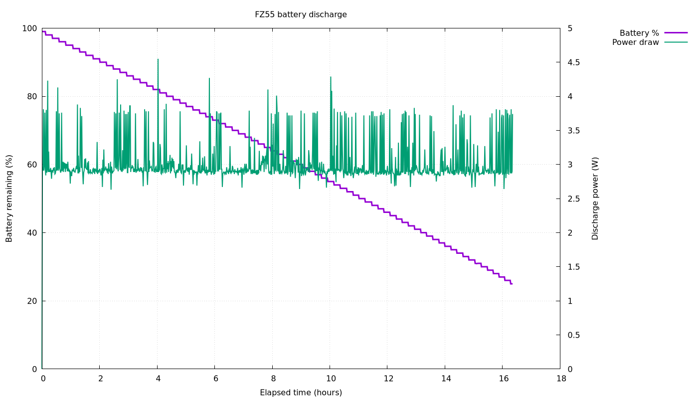

# Panasonic FZ55 battery runtime test

This procedure records battery percentage, stored energy and power draw once per minute, then produces a PNG discharge graph.





## Battery condition

Detected battery: Panasonic **FZ-VZSU1H**, serial `00938`.

| Item | Value |
|---|---:|
| Design capacity | 68.04 Wh |
| Current full capacity | 63.97 Wh |
| Battery health | 94.0% |
| Capacity loss | 6.0% |
| Charge cycles | 150 |

Battery health is `energy_full / energy_full_design × 100`.

## Install tools

```bash
sudo apt install upower gnuplot
```

## Record a discharge

Save this as `~/battery-test.sh`:

```bash
#!/bin/bash

OUT="${1:-$HOME/battery-test-$(date +%Y%m%d-%H%M%S).csv}"
DEVICE="/org/freedesktop/UPower/devices/DisplayDevice"
START=$(date +%s)

printf 'timestamp,elapsed_minutes,percentage,energy_Wh,power_W,time_to_empty_hours,state\n' > "$OUT"
echo "Logging to: $OUT"

while true; do
    NOW=$(date +%s)
    INFO=$(LC_ALL=C upower -i "$DEVICE")

    TIMESTAMP=$(date --iso-8601=seconds)
    ELAPSED=$(( (NOW - START) / 60 ))
    PERCENT=$(awk '/percentage:/ {gsub("%","",$2); print $2}' <<<"$INFO")
    ENERGY=$(awk '/^[[:space:]]*energy:/ {print $2}' <<<"$INFO")
    POWER=$(awk '/energy-rate:/ {print $2}' <<<"$INFO")
    STATE=$(awk '/state:/ {print $2}' <<<"$INFO")
    TTE=$(awk '/time to empty:/ {
        if ($5 == "hours") print $4
        else if ($5 == "minutes") print $4 / 60
        else print ""
    }' <<<"$INFO")

    printf '%s,%s,%s,%s,%s,%s,%s\n' \
        "$TIMESTAMP" "$ELAPSED" "$PERCENT" "$ENERGY" \
        "$POWER" "$TTE" "$STATE" >> "$OUT"
    sleep 60
done
```

Make it executable, start it while fully charged, and then disconnect AC:

```bash
chmod +x ~/battery-test.sh
~/battery-test.sh
```

Keep screen brightness, power profile, radios, attached devices and workload consistent when comparing tests. Stop with `Ctrl-C`, or allow the normal critical-battery shutdown to occur.

## Plot the result

Substitute the actual CSV filename:

```bash
gnuplot -persist <<'EOF'
set datafile separator comma
set title "FZ55 battery discharge"
set xlabel "Elapsed time (hours)"
set ylabel "Battery remaining (%)"
set y2label "Discharge power (W)"
set yrange [0:100]
set y2range [0:*]
set y2tics
set grid
set key outside
set terminal pngcairo size 1400,800
set output "battery-drain.png"

plot \
  "battery-test.csv" using ($2/60):3 with lines linewidth 3 title "Battery %", \
  "battery-test.csv" using ($2/60):5 axes x1y2 with lines linewidth 2 title "Power draw"
EOF
```

Approximate runtime is:

```text
runtime in hours = usable energy in Wh / average power in W
```

With the present 63.97 Wh capacity, an 8 W average load corresponds to about 8 hours; 12 W corresponds to about 5.3 hours.
